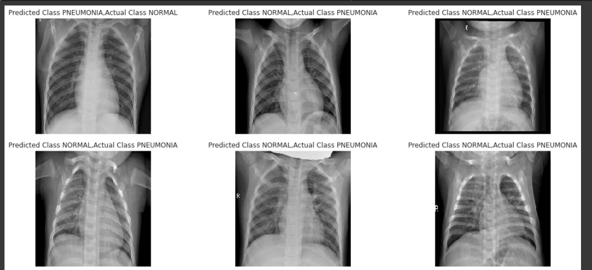
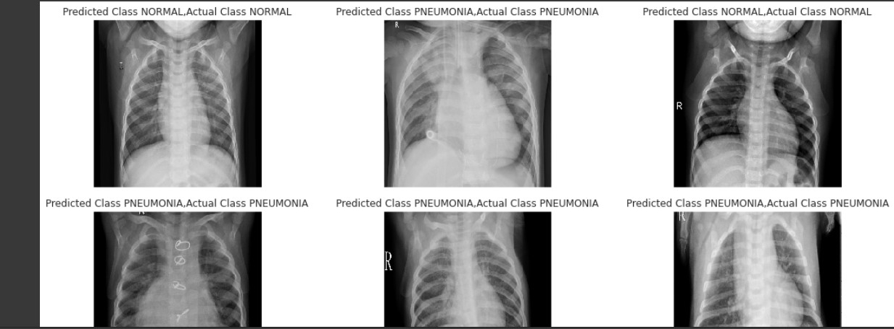

# Multiclass-classification-using-a-novel-CNN-architecture
## Project for Selected topic-2 in CS
# (CNN)
## The project is to choose a paper and apply the same algorithm in another dataset in same domain and try to increase the accuracy
### You can find the dataset <a href="https://drive.google.com/drive/folders/1F2jmLwFdt_mHFAAw6DpxdPVIkAyYxoZt?usp=sharing">here</a>

## Examples of correct images and incorrect images

